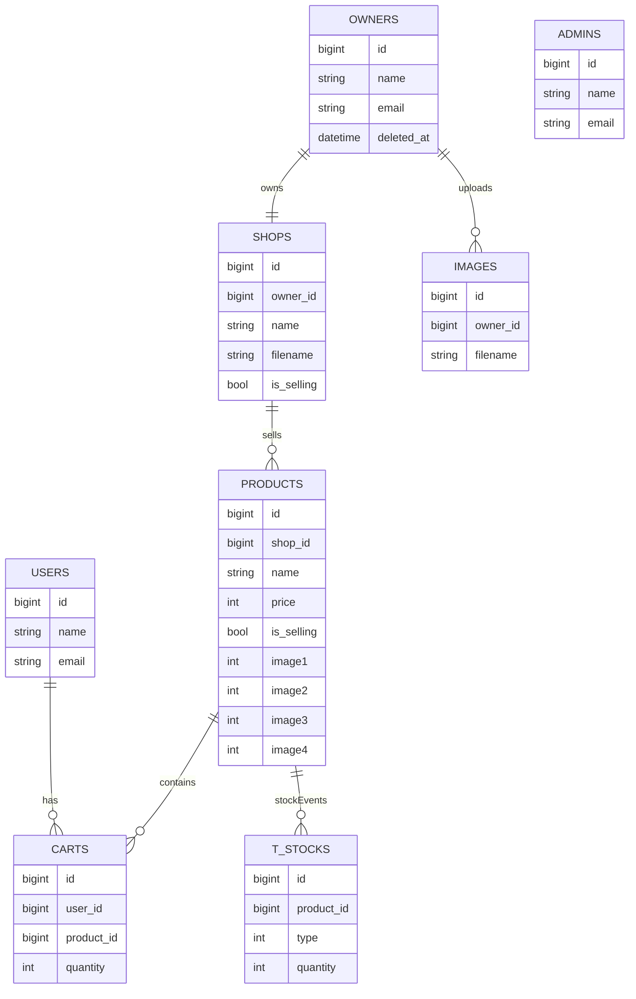
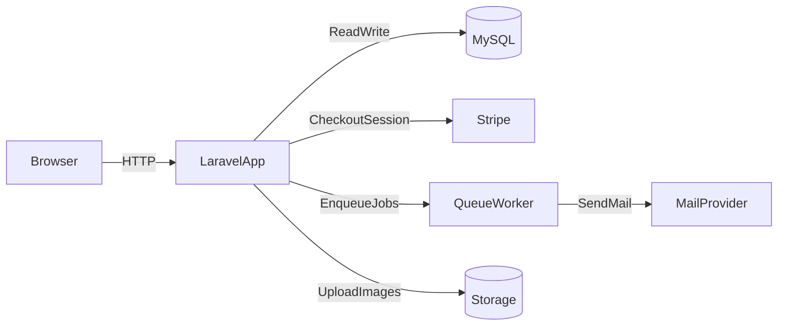

# マルチログイン対応のEC風アプリケーション

ユーザーが商品を検索・購入でき、オーナーが商品/在庫/画像/店舗情報を管理できる、マルチログイン対応のEC風アプリケーションです（学習用プロジェクト）。

<!-- 
 -->

## デモ公開用URL

- **User（購入者）用URL**: `https://hi-shiraishi.sakura.ne.jp/login`
- **Owner（出品者/店舗運用者）用URL**: `https://hi-shiraishi.sakura.ne.jp/owner/login`
- **Admin（ECサイト管理者）用URL**: `https://hi-shiraishi.sakura.ne.jp/admin/login`

※ 上記デモURLには ベーシック認証（HTTP Basic 認証）をかけております。ベーシック認証のユーザー名・パスワードは 定期的に変更しているため、ご不明な場合は お手数ですがご連絡ください。

## テストアカウント

動作確認する際に利用できる例です。

| ロール | メールアドレス | パスワード |
|--------|----------------|------------|
| **User（購入者）** | `test@test.com` | `password123` |
| **Owner（出品者/店舗運用者）** | `test1@test1.com` | `password123` |
| **Admin（アプリケーション管理者）** | `test@test.com` | `password123` |

※ User と Admin は別ガードのため、同じメールアドレスでもそれぞれのログイン画面から利用できます。

## 概要 / 開発した背景

Laravelの典型的な「ECの購入体験」と「運用（商品・在庫・画像・店舗）」を1つのアプリで扱うことを目的に、以下を重点に実装/学習しました。

- **購入体験の一連**（商品一覧→詳細→カート→決済→完了）
- **運用者向け管理**（商品CRUD、在庫の増減、画像管理、店舗情報）
- **権限分離**（User / Owner / Admin のマルチ認証）
- **外部サービス連携**（Stripe決済、メール送信、画像リサイズ/保存）

## 画面 / 機能

### User（購入者）

- **商品一覧**: カテゴリ/キーワード検索、並び替え、表示件数切替、ページネーション
  - 例: [`app/Http/Controllers/User/ItemController.php`](app/Http/Controllers/User/ItemController.php), [`resources/views/user/index.blade.php`](resources/views/user/index.blade.php)
- **商品詳細**: 複数画像スライダー（Swiper）、在庫に応じた購入数量選択
  - 例: [`resources/views/user/show.blade.php`](resources/views/user/show.blade.php)
- **カート**: 追加/削除、小計計算
  - 例: [`app/Http/Controllers/User/CartController.php`](app/Http/Controllers/User/CartController.php), [`resources/views/user/cart.blade.php`](resources/views/user/cart.blade.php)
- **Stripe決済（Checkout）**: 決済成功/キャンセルに応じた遷移
  - 例: [`resources/views/user/checkout.blade.php`](resources/views/user/checkout.blade.php)
- **購入後メール**: 購入者へサンクスメール、各オーナーへ注文通知（キュー実行を想定）
  - 例: [`app/Jobs/SendThanksMail.php`](app/Jobs/SendThanksMail.php), [`app/Jobs/SendOrderedMail.php`](app/Jobs/SendOrderedMail.php)

### Owner（出品者/店舗運用者）

- **店舗情報管理**: 店舗名/説明/販売ステータス、店舗画像アップロード
  - 例: [`app/Http/Controllers/Owner/ShopController.php`](app/Http/Controllers/Owner/ShopController.php)
- **画像管理**: 商品画像の複数アップロード、商品で利用中の画像は参照解除してから削除
  - 例: [`app/Http/Controllers/Owner/ImageController.php`](app/Http/Controllers/Owner/ImageController.php)
- **商品管理**: 商品CRUD、カテゴリ設定、複数画像紐付け、販売中/停止中
  - 例: [`app/Http/Controllers/Owner/ProductController.php`](app/Http/Controllers/Owner/ProductController.php)
- **在庫管理**: 在庫は履歴（増減レコード）として保持し、集計して現在庫を算出
  - 例: [`app/Models/Stock.php`](app/Models/Stock.php), [`app/Models/Product.php`](app/Models/Product.php)

### Admin（管理者）

- **オーナー管理**: 一覧/作成/編集/削除
  - 例: [`app/Http/Controllers/Admin/OwnersController.php`](app/Http/Controllers/Admin/OwnersController.php), [`routes/admin.php`](routes/admin.php)
- **期限切れオーナー**: ソフトデリート済みの一覧/物理削除

## 使用技術

### Backend

- **PHP**: `^7.3|^8.0`（`composer.json`）
- **Laravel**: `^8.12`（`composer.json`）
- **認証**: Laravel Breeze（`laravel/breeze`）
- **決済**: Stripe（`stripe/stripe-php`）
- **画像処理**: Intervention Image（`intervention/image`）
- **メール/キュー**: Job + Queue（`ShouldQueue`を利用）

### Frontend / UI

- **Tailwind CSS**: `^2.2.19`
- **Alpine.js**: `^2.7.3`
- **Swiper**: `^6.7.0`
- **MicroModal**: `^0.6.1`
- **ビルド**: Laravel Mix（`laravel-mix`）

### DB

- **MySQL**

## 設計のポイント

- **マルチ認証（User/Owner/Admin）**: ガードを分けて、URLプレフィックスとルーティングも分離
  - 例: [`config/auth.php`](config/auth.php), [`app/Providers/RouteServiceProvider.php`](app/Providers/RouteServiceProvider.php)
- **在庫の扱い**: 在庫を“現在値”ではなく“増減履歴”として持ち、集計で現在庫を出す
  - 例: `t_stocks`（[`app/Models/Stock.php`](app/Models/Stock.php)）
- **購入フローの整合**: 決済前に在庫を引き当て、キャンセル時は戻す（購入処理の不整合を防ぐ）
  - 例: [`app/Http/Controllers/User/CartController.php`](app/Http/Controllers/User/CartController.php)
- **オーナー所有チェック**: URL直叩き対策として、編集系アクションで「ログインオーナーの所有物か」を確認
  - 例: [`app/Http/Controllers/Owner/ProductController.php`](app/Http/Controllers/Owner/ProductController.php), [`app/Http/Controllers/Owner/ImageController.php`](app/Http/Controllers/Owner/ImageController.php)
- **画像アップロードの一元化**: 画像のリサイズ・保存処理をサービスに集約
  - 例: [`app/Services/ImageService.php`](app/Services/ImageService.php)

## ER図（概略）

## インフラ構成（概略）

## 今後の実装の展望

- **注文データの永続化**: 「注文」テーブルを追加し、購入履歴/売上管理を実装
- **決済の堅牢化**: Webhookで決済確定を受け、在庫引当/注文確定をサーバー側で最終確定できるようにする
