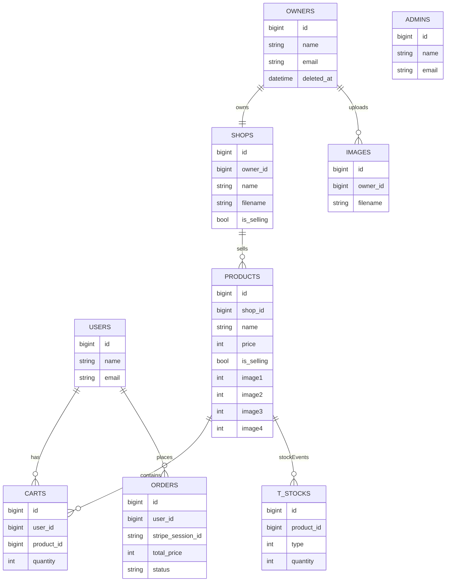
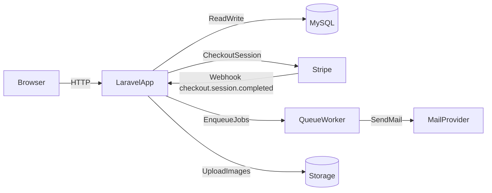

# マルチログイン対応のEC風アプリケーション

ユーザーが商品を検索・購入でき、オーナーが商品/在庫/画像/店舗情報を管理できる、マルチログイン対応のEC風アプリケーションです。

<!-- 
 -->

## デモ公開用URL

- **User（購入者）用URL**: `https://hi-shiraishi.sakura.ne.jp/login`
- **Owner（出品者/店舗運用者）用URL**: `https://hi-shiraishi.sakura.ne.jp/owner/login`
- **Admin（ECサイト管理者）用URL**: `https://hi-shiraishi.sakura.ne.jp/admin/login`

※ 上記デモURLには ベーシック認証（HTTP Basic 認証）をかけております。ベーシック認証のユーザー名・パスワードは 定期的に変更しているため、ご不明な場合は お手数ですがご連絡ください。

※ また、ベーシック認証を設定のままだと Stripe Webhook は受信失敗となるため、Stripe の購入フローを実際にお試したいとのご要望があれば、一時的に解除させていただきますので、お手数ですがご連絡ください。

## テストアカウント

動作確認する際に利用できる例です。

| ロール | メールアドレス | パスワード |
|--------|----------------|------------|
| **User（購入者）** | `user-a@test.com` | `password123` |
| **Owner（出品者/店舗運用者）** | `owner-a@test.com` | `password123` |
| **Admin（アプリケーション管理者）** | `admin@test.com` | `password123` |

## 概要 / 開発した背景

Laravelの典型的な「ECの購入体験」と「運用（商品・在庫・画像・店舗）」を1つのアプリで扱うことを目的に、以下を重点に実装しました。

- **購入体験の一連**（商品一覧→商品詳細→カート→決済→完了）
- **運用者向け管理**（商品CRUD、在庫の増減、商品画像、店舗情報）
- **権限分離**（User / Owner / Admin のマルチ認証）
- **外部サービス連携**（Stripe Checkout / Webhook、メール送信、画像リサイズ/保存）

## 画面 / 機能

### User（購入者）

- **商品一覧**: 大カテゴリ・小カテゴリとキーワード検索、並び替え、表示件数切替、ページネーション（在庫のある商品のみ一覧表示）
  - 例: [`app/Http/Controllers/User/ItemController.php`](app/Http/Controllers/User/ItemController.php), [`resources/views/user/index.blade.php`](resources/views/user/index.blade.php)
- **商品詳細**: 複数画像スライダー（Swiper）、在庫に応じた購入数量選択
  - 例: [`resources/views/user/show.blade.php`](resources/views/user/show.blade.php)
- **カート**: 追加/削除、小計計算
  - 例: [`app/Http/Controllers/User/CartController.php`](app/Http/Controllers/User/CartController.php), [`resources/views/user/cart.blade.php`](resources/views/user/cart.blade.php)
- **Stripe決済（Checkout）**: Checkout Session 作成 → Stripe 上で決済。`client_reference_id` にユーザー ID を載せ、Webhook 側でカート所有者を特定。
  - 例: [`app/Http/Controllers/User/CartController.php`](app/Http/Controllers/User/CartController.php), [`resources/views/user/checkout.blade.php`](resources/views/user/checkout.blade.php)
- **Stripe Webhook によるフルフィルメント**: `checkout.session.completed` を受信したタイミングで、商品の在庫減算・`orders` レコード作成・購入メールの dispatch・カート削除を**サーバー間で一括実行**（ブラウザの `success_url` 到達に依存しない）。メール用のカート相当データは [`app/Services/CartService.php`](app/Services/CartService.php) で組み立て
  - エンドポイント: `POST /api/webhook/stripe`
  - 例: [`app/Http/Controllers/Api/StripeWebhookController.php`](app/Http/Controllers/Api/StripeWebhookController.php), [`app/Services/CheckoutWebhookFulfillmentService.php`](app/Services/CheckoutWebhookFulfillmentService.php), [`routes/api.php`](routes/api.php)
- **注文データ（ヘッダ行）**: `orders` テーブルにユーザー・StripeセッションID（冪等用 UNIQUE）・合計金額・ステータスを保存
  - 例: [`app/Models/Order.php`](app/Models/Order.php)
- **購入後メール**: 購入者へサンクスメール、各オーナーへ注文通知（Webhook フルフィル完了後にキュー dispatch）
  - 例: [`app/Jobs/SendThanksMail.php`](app/Jobs/SendThanksMail.php), [`app/Jobs/SendOrderedMail.php`](app/Jobs/SendOrderedMail.php)

### Owner（出品者/店舗運用者）

- **店舗情報管理**: 店舗名/説明/販売ステータス、店舗画像アップロード
  - 例: [`app/Http/Controllers/Owner/ShopController.php`](app/Http/Controllers/Owner/ShopController.php)
- **商品管理**: 商品CRUD、カテゴリ設定、複数画像紐付け、販売ステータス
  - 例: [`app/Http/Controllers/Owner/ProductController.php`](app/Http/Controllers/Owner/ProductController.php)
- **画像管理**: 商品画像の複数アップロード、商品で利用中の画像は参照解除してから削除
  - 例: [`app/Http/Controllers/Owner/ImageController.php`](app/Http/Controllers/Owner/ImageController.php)
- **在庫管理**: 在庫は履歴（増減レコード）として保持し、集計して現在の在庫を算出
  - 例: [`app/Models/Stock.php`](app/Models/Stock.php), [`app/Models/Product.php`](app/Models/Product.php)

### Admin（管理者）

- **オーナー管理**: 一覧/作成/編集/削除
  - 例: [`app/Http/Controllers/Admin/OwnersController.php`](app/Http/Controllers/Admin/OwnersController.php), [`routes/admin.php`](routes/admin.php)
- **期限切れオーナー**: ソフトデリート済みのオーナー一覧/物理削除（ハードデリート）

## 使用技術

### Backend

- **PHP**: `^7.3|^8.0`（`composer.json`）
- **Laravel**: `^8.12`（`composer.json`）
- **認証**: Laravel Breeze（`laravel/breeze`）
- **決済**: Stripe（`stripe/stripe-php ^19`）
- **画像処理**: Intervention Image（`intervention/image`）
- **メール/キュー**: Job + Queue（`ShouldQueue`を利用）
- **HTTP クライアント**: Guzzle（`guzzlehttp/guzzle ^7`）

### Frontend / UI

- **Tailwind CSS**: `^2.2.19`
- **Alpine.js**: `^2.7.3`
- **Swiper**: `^6.7.0`
- **MicroModal**: `^0.6.1`
- **ビルド**: Laravel Mix `^6.0.6`（`package.json`）

### DB

- **MySQL**

## 設計のポイント

- **マルチ認証（User/Owner/Admin）**: ガードを分けて、URLプレフィックスとルーティングも分離
  - 例: [`config/auth.php`](config/auth.php), [`app/Providers/RouteServiceProvider.php`](app/Providers/RouteServiceProvider.php)
- **在庫の扱い**: 在庫を“現在値”ではなく“増減履歴”として持ち、集計で現在の在庫を出す
  - 例: `t_stocks`（[`app/Models/Stock.php`](app/Models/Stock.php)）
- **購入フローの整合**: 決済確定の正は **Stripe Webhook**。セッション作成時点では在庫を減らさず、Webhook 内で在庫ロック・在庫減算・注文作成をトランザクション化。`orders.stripe_session_id` の UNIQUE と `lockForUpdate（悲観ロック）` で冪等性と競合を抑止。在庫不足・空カート時は返金試行（ログに記録）
  - 例: [`app/Services/CheckoutWebhookFulfillmentService.php`](app/Services/CheckoutWebhookFulfillmentService.php), [`app/Http/Controllers/User/CartController.php`](app/Http/Controllers/User/CartController.php)
- **オーナー所有チェック**: URL直叩き対策として、編集系アクションで「ログインオーナーの所有物か」を確認
  - 例: [`app/Http/Controllers/Owner/ProductController.php`](app/Http/Controllers/Owner/ProductController.php), [`app/Http/Controllers/Owner/ImageController.php`](app/Http/Controllers/Owner/ImageController.php)
- **画像アップロードの一元化**: 画像のリサイズ・保存処理をサービスに集約
  - 例: [`app/Services/ImageService.php`](app/Services/ImageService.php)
- **Webhook の入口**: Stripe からの通知は `routes/api.php`（`/api` プレフィックス）経由。`web` ミドルウェアではないため **CSRF 検証の対象外**で、代わりに **`Stripe-Signature` 署名検証**（`Webhook::constructEvent`）で正当性を担保
  - 例: [`app/Http/Controllers/Api/StripeWebhookController.php`](app/Http/Controllers/Api/StripeWebhookController.php)

## ER図（概略）

## インフラ構成（概略）

## 自動テスト（Feature / PHPUnit）

回帰防止のため、主要なドメインまわりに Feature テストを置いています。

- **Stripe Webhook**: 署名欠如・シークレット未設定・署名不正、`checkout.session.completed` 以外の無視、正常系（在庫・`orders`・メール dispatch・カート削除）、冪等（同一セッション再送）、在庫不足時の挙動
  - [`tests/Feature/stripeWebhookTest.php`](tests/Feature/stripeWebhookTest.php)（クラス名 `StripeWebhookTest`）
- **在庫と商品一覧**: `Product::availableItems()` まわり（在庫 1 でも一覧に出ることなど）
  - [`tests/Feature/StockCheckoutTest.php`](tests/Feature/StockCheckoutTest.php)

テスト実行: `php artisan test` または `vendor/bin/phpunit`（**PHPUnit 9**、`composer.json` の require-dev）。Webhook 用のダミー値は [`phpunit.xml`](phpunit.xml) を参照。

## 環境変数（決済まわり・抜粋）

本番・ローカルで Stripe を使う場合は [`.env.example`](.env.example) の `STRIPE_SECRET_KEY` / `STRIPE_PUBLIC_KEY` / `STRIPE_WEBHOOK_SECRET` を設定します。ローカルでは Stripe CLI の `stripe listen --forward-to` で Webhook を受け取る想定です。

## 今後の実装の展望

- **注文明細**: `order_items` などで行単位を永続化し、返品・部分返金に耐えるモデルへ拡張
- **購入者向け購入履歴**: `orders` を起点にしたマイページ表示
- **運用向け売上・出荷**: Owner 画面からの注文一覧・ステータス更新（発送済みなど）
- **商品レビュー**: 購入者による評価・コメント機能
